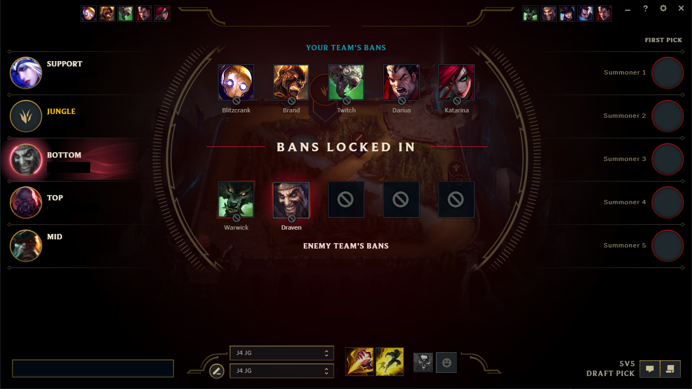
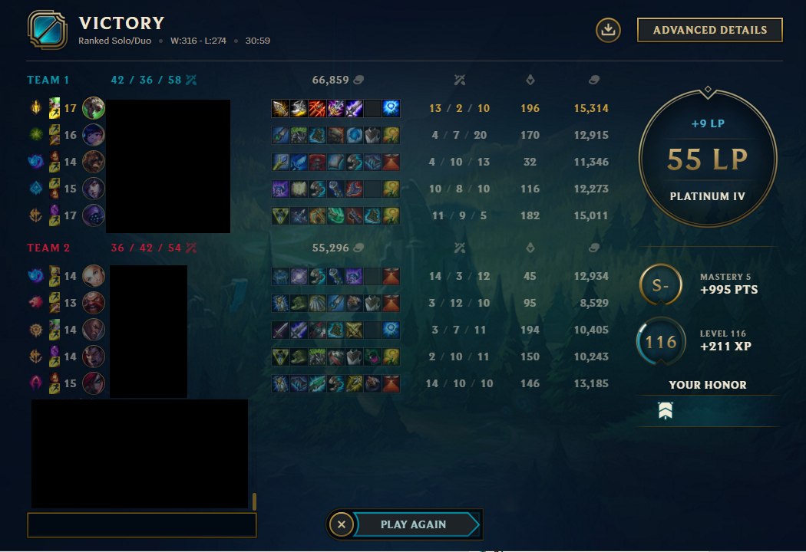

# What is League of Legends?


### League of Legends is a multiplayer online battle areana (MOBA) made by Riot Games in 2009. It is a team-based strategy game where two teams of five champions face off to destroy the other’s base. Each player gets to choose from over 150 champions to battle their way to victory. Due to League of Legends being one of the most popular and competitive games worldwide, there is a lot of data and information to analyze.

---

# Why Look Into League Data?

### League of Legends matches are never going to follow a strict pattern due to the nature of the game. The game allows the players to make many decisions that can effect the outcome of the game. Because of this, one game will never be the same as another. By analysing data from the ranked players in League of Legends, we can delve into what makes certain champions strong in a solo queue environment. We can view how different regions play the game, what champions thrive in each region, and draw a conclusion on the overall playstyle of a region based on their picks.

---

# Background Information

### To first understand on how to read the data, one has to understand the ranking system in League of Legends. League of Legends lets players play ranked games once they have hit level 30 on their account. This allows them to have ample time to understand the game and then they can play in the competitve game mode. Each account starts off unranked and after 10 games the account is placed into a rank based on their performance. The ranks are as following: Iron, Bronze, Silver, Gold, Platinum, Diamond, Master, Grandmaster, and Challenger. The highest a new ranked account can place after 10 games is Platinum 4 and then if they wish to get higher ranked they must play more and continue winning. The top 3 highest ranks have a 24 hours refresh timer that constantly adds and kicks people out based on their performance. This allows for players to remain competitive and see how close others are from taking their spot on the ladder.


### Now since the ranks have been discussed, one must understand how League of Legends games work. League of Legends games put five players against another five players. In ranked games, each player on your and the enemy team is allowed to ban one champion. This allows for each person to ban certain matchups that they do not want to face. In this loading screen, the player is allowed to pick 2 summoner spells and runes that will have a large impact on how they play the game. After a short delay, the game then will start. Below is an example of the picking and banning phase of the game and an example of a rune page.



### After the game is over, the winning team gains LP (League Points) which when they reach 100 points they move on to the next rank. When a player qualifies to reach the next divison they must play a best of 5 games. If they win three of these games, they promote and move onto the next division. If they fail, they stay the same divison and lose LP. Below is an example that shows the gain of LP based on a win.


---

# Gathering the Data

### We gather the data from webscraping a few websites. The first website is called OP.GG and Riot Games has given them an API to use to easily gather this data. As the information is stored in a JSON, we can use the library jsonlite to get the information. Once we have successfully obtained this information in a list of lists, we can access the list and turn in into a tibble to start tidying the data. The second website we scrap is leagueofgraphs to get the overall ranked distribution of the regions we are looking at, and the average game length time.

```{r pacman_setup, include=FALSE}
# Run this ONE-TIME ONLY to install
# the pacman package loader, This 
# makes downloading and loading the 
# packages much easier and neater.
# install.packages("pacman")
```

```{r libraries, include=FALSE}
#1. Download & Load Libraries

knitr::opts_chunk$set(echo = TRUE)
## Use pacman to download and load
## the rest of the packages needed
pacman::p_load(
  "tidyverse",
  "dplyr",
  "rvest",
  "robotstxt",
  "jsonlite",
  "gridExtra",
  "cowplot",
  "ggpubr",
  "RSelenium",
  "lubridate",
  "rjson"
)
```

```{r crr_data, warning=FALSE}
##2. Get all the data from all regions for each
# rank and champion.

#Define vector of all the regions we want to obtain data from.
allRegions <- c("na", "kr", "euw", "eune")

#Define vector for all ranks. The combined average of all ranks is a blank string.
allranks <-
  c(
    "",
    "iron",
    "bronze",
    "silver",
    "gold",
    "platinum",
    "diamond",
    "master",
    "grandmaster",
    "challenger"
  )

#Make a empty variable that will be used to hold the final results.
full_stats <- c()

#Read champion roles from csv file.
champ_roles <-
  read_csv("data/Champion_roles_id.csv", show_col_types = FALSE)

#Get all champion data from json.
#Region doesn't matter, all champions are the same across all regions.
champion_id_json <-
  jsonlite::fromJSON("https://na.op.gg/api/meta/champions?hl=en_US") %>%
  map_if(is.data.frame, list) %>%
  as_tibble()

#Access the list we created and
#only take the data we want from the json. 
champ_info_tibble <- as_tibble(champion_id_json[[1]][[1]]) %>%
  select(1, 3)

#For loop to get all the data from each region from vector created earlier.
for (region in allRegions) {
  for (rank in allranks) {
    stats_json <-
      jsonlite::fromJSON(
        paste0(
          'https://',
          region,
          '.op.gg/api/statistics/',
          region,
          '/champions/ranked?period=month&tier=',
          rank
        )
      ) %>%
      map_if(is.data.frame, list) %>%
      as_tibble()
    
    #Open up the list we made out of the json and
    #wrangle and tidy all the data we need.
    stats_tibble <- as_tibble(stats_json[[1]][[1]])
    
    #Remove NAs from the data (mostly challenger ranked data).
    stats_tibble <- na.omit(stats_tibble)
    
    #Rename variables to more understand variables and
    #get the average per game stats for each champion.
    stats_tibble <- stats_tibble %>%
      rename(id = champion_id,
             total_games = play,
             jungle_cs = neutral_cs) %>%
      mutate(
        kills_per_game = kill / total_games,
        deaths_per_game = death / total_games,
        assists_per_game = assist / total_games,
        deaths_per_game = death / total_games,
        wards_per_game = ward / total_games,
        gold_per_game = gold / total_games,
        cs_per_game = cs / total_games,
        jg_cs_per_game = jungle_cs / total_games,
        win_rate = (win / total_games) * 100,
        region = region,
        rank = rank,
        sumofallgames = sum(total_games)
      )
    #Join the names of champions to the data
    temp_full_stats <-
      merge(x = stats_tibble, y = champ_info_tibble, by = "id")
    
    #Join the champion roles to the data
    temp_full_stats <- temp_full_stats %>%
      right_join(champ_roles, by = c("id", "name"))
    
    #Build a full stats tibble out of these tables for each
    #rank and region by binding them each time at the end
    #of the loop.
    full_stats <- rbind(full_stats, temp_full_stats)
  }
}

#For clarity sake, rename the all rank to be called all not
#just a blank string as it is originally.
full_stats$rank[full_stats$rank == ""] <- "all"

#Save and write the data as the current date.
#This is just in case we cannot retrieve the
#data in the future. The data is updated every month but in
#case of failure, we can check the csv's manually to see when
#the data starts to be incorrect. This will more than likely
#happen when the website changes how they build their urls.
fdate = Sys.Date()
write_csv(full_stats, file = (paste0("data/", fdate, ".csv")))

```

---
# Visualizing the Data

## Rank Distrubution

### After all the data has been put into a main tibble, we can then filter the data based to visualize it. First we will look into the rank distrubutions between the 4 regions and take a look into all the games played in those servers. We can look to see if certain regions are more dedicated to their ranks compared to others and also identify why this is.

```{r all_reg_distribution, warning=FALSE}
##3. Get the data required for the rank
#distribution graphs of the 4 regions
#that were defined earlier.

#Vector hard coded to be used to fill the distribution
#graph of the ranked players in each region. There are
#4 of the lower tiers because there is Iron 4, Iron 3,
#Iron 2, Iron 1, and all of these are in the division of Iron.

RD_SC <-
  c(
    "Challenger",
    "GrandMaster",
    "Master",
    "Diamond",
    "Diamond",
    "Diamond",
    "Diamond",
    "Platinum",
    "Platinum",
    "Platinum",
    "Platinum",
    "Gold",
    "Gold",
    "Gold",
    "Gold",
    "Silver",
    "Silver",
    "Silver",
    "Silver",
    "Bronze",
    "Bronze",
    "Bronze",
    "Bronze",
    "Iron",
    "Iron",
    "Iron",
    "Iron"
  )

#Define Hex-codes to color the
#bar graph that will be created.
ts_cl = c(
  "Iron" =  "#696969", 
  "Bronze" = "#B08D57", 
  "Silver" = "#A9A9A9", 
  "Gold" = "#FFD700",  
  "Platinum" = "#C0C0C0",
  "Diamond" = '#ADD8E6',
  "Master" = '#C576F6',
  "GrandmMaster" = '#FF7F50',
  "Challenger" = '#00FFFF'
  ) 

#To order the ranks correctly, we will
#give them a number to correctly display them
#on the bar graph.
RD_O <- c(1, 2, 3, 4, 4, 4, 4, 5, 5, 5, 5, 6, 6, 6, 6, 7, 7, 7, 7, 8, 8, 8, 8, 9, 9, 9, 9)

#Blank vector to hold everything in the end
All_RD <- c()

#Web scrape to obtain distribution of ranks
for (regs in allRegions) {
  #web-scrape with url
  Page <-
    read_html(paste0(
      "https://www.leagueofgraphs.com/rankings/rank-distribution/",
      regs
    ))
  
  #Use selector gadget and rvest to grab the
  #data we want from the website.
  RD_Percent <- Page %>%
    html_nodes(".box-padding-10:nth-child(1) i") %>%
    html_text() %>%
    str_remove_all("%") %>%
    as.double()
  
  RD_Rank <- Page %>%
    html_nodes(".box-padding-10:nth-child(1) .nowrap") %>%
    html_text() %>%
    str_remove_all("\n") %>%
    str_trim()
  
  #Construct a tibble out of the data and bind it all
  #together so we can have a tibble that holds all the 
  #data.
  RDT <- tibble(regs, RD_Rank, RD_Percent, RD_SC, RD_O)
  All_RD <- rbind(All_RD, RDT)
}

#Graph the data.
for (regions in allRegions) {
  Rank_Distribution <- All_RD %>%
    filter(regs == regions) %>%
    ggplot(aes(
      x = reorder(RD_Rank, RD_O),
      y = RD_Percent,
      fill = RD_SC,
      label = scales::percent(RD_Percent/100, accuracy = 0.01)
    )) +
    geom_bar(stat = "identity", color="black") + 
    #prevent overlapping
    geom_text(hjust = -0.1, size = 3) +
    xlab("") +
    #remove the x-axis title
    ylab("") + 
    #remove the y-axis title
    ggtitle(paste0("League of Legends ", regions, " Rank Distribution")) + 
    #Build title using the index of loop
    theme(
      plot.title = element_text(hjust = 0.5, face = 2),
      #Center title of graph
      text = element_text(size = 12),
      #Make Font size smaller
      legend.position = "none"
      #Delete legend
    ) +
    labs(fill = "Rank") +
    #Fill by the rank
    coord_flip() +
    #flip the coordinates to nicely
    #display the graph
    scale_y_continuous(expand=expansion(mult=c(0,0.08)))+
    #expand the graph so there cutoff parts of the graph
        scale_fill_manual(values = ts_cl, drop = FALSE) 
  #fill the graphs based on the hex values defined earlier.
  
  #Print each graph by itself so we can view it.
  print(Rank_Distribution)
  
}
```

### Conclusion: North America (NA) has a greater distribution of ranks around the lower ranks which include iron through gold. Korea (kr) has a much larger distribution near the higher ranks which include gold-diamond but the top ranks (Master-Challenger) are extremely low compared to other regions. Europe West has a very similiar distrubution to North America but has a higher distribution in the lower ranks and a higher distribution in Diamond through Master. Europe North-East has the most distinct distribution as the region has the distribution bottom divisions of each rank (Iron IV, Bronze IV, Gold IV, etc).

## Time Spent Playing Per Region

### To see how much time has been spent on League of Legends in the last month we can create a sum of the "all" ranks in order to get the total number of ranked games played in a single month for a region. Then we will use Selenium to webscrap from another website to get the average game-lenght for each region and rank. From here we can see how long each region has spent playing the game.

```{r timespent_data, echo=FALSE, warning=FALSE, include=FALSE}
##4. Get the data required to graph the time-spent
#for each region and ranks.

#define empty vector to hold all the
#game-length times
all_GLT <- c()

#Open Firefox with selenium, standard
#practice to wait a few seconds before each
#new command.
selCommand <- wdman::selenium(jvmargs = c("-Dwebdriver.chrome.verboseLogging=true"), retcommand = TRUE)
Sys.sleep(2)
shell(selCommand, wait = FALSE, minimized = TRUE)
Sys.sleep(2)
#Local-host port for selenium and uses Firefox.
remdr <- remoteDriver(port = 4567L, browserName = "firefox")
Sys.sleep(2)
#Open the remote-driver
remdr$open()

for(regs2 in allRegions){
#navigate to the link
remdr$navigate(url = paste0('https://www.leagueofgraphs.com/rankings/game-durations/',regs2))

#read page source
pgSrc <- remdr$getPageSource()
page <- read_html(pgSrc[[1]])

#Scrap data using rvest and selector gadget.
gl_surrender <- page %>%  
  html_nodes(".columns:nth-child(1) td:nth-child(2) .progressBarTxt") %>%
  html_text() %>%
  ms() %>%
  period_to_seconds()

gl_nosur <- page %>%  
  html_nodes(".columns:nth-child(1) td~ td+ td .progressBarTxt") %>%
  html_text() %>%
  ms() %>%
  period_to_seconds()

rank <- page %>%
  html_nodes(".columns:nth-child(1) td:nth-child(1)") %>%
  html_text() %>%
  trimws()

#Get the unique values only for each region.
#This allows us to get the average game length
#per region.
Region_Total_Games <- full_stats %>%
  filter(region == regs2) %>%
  summarise(regs2, rank, sumofallgames) %>%
  unique()

#Remove the first column so we have compatible
#vector sizes.
Region_Total_Games = Region_Total_Games[-1,]
  
#Game-length tibble which we will append together.
# Divide the game-length by 60 as they originally come into seconds.
#Multiply the sumofallgames by the game-length in minutes to find out
#how many minutes were spent playing league of legends for that rank
#and region.
GLT <- tibble(regs2, rank, GLSM = mean(gl_surrender/60), GLNSM = mean(gl_nosur/60), 
              sumofallgames = Region_Total_Games$sumofallgames, 
              GLS_Time = GLSM * sumofallgames, GLNS_Time = GLNSM * sumofallgames)

#Bind them all together in a tibble.
all_GLT <- rbind(all_GLT, GLT)
}

#Close the remote-driver of Firefox.
remdr$close()

```

```{r timespent_graphs}
##5. Graphs the time-spent playing LoL
#for each rank and region.

#set Scientific notation of 10
options(scipen=10)

#Filter and graph data for each 
#region.
for(regs3 in allRegions){
  GLT_Graph <- all_GLT %>%
    filter(regs2 == regs3) %>%
    ggplot(aes(
      x = reorder(rank, GLS_Time),
      #descending order
      y = GLS_Time/1440,
      #make the time in days (1440 minutes = 1 day)
      fill = rank,
      #fill based on rank
      label = round(GLS_Time/1440, digits = 0)
      #label the days,
    )) +
    geom_bar(stat = "identity", color = "black") +
    xlab("") + 
    #remove the x-axis title
    ylab("") + 
    #remove the y-axis title
    ggtitle(paste0(regs3," Time Spent Playing Ranked (in Days)")) + 
        #Build title using the index of loop
    geom_text(hjust =-0.2, size = 5)+
  #make the text smaller
    theme(
      plot.title = element_text(hjust = 0.5),
      #Center title of graph
      text = element_text(size = 13),
      #make the text smaller
      legend.position = "none"
      #remove the legend
    )  +
    coord_flip() +
      #flip the coordinate to fit graph easier
    scale_y_continuous(expand=expansion(mult=c(0,0.20))) +
      #expand the graph so no data is clipped off.
    scale_fill_manual(values = ts_cl, drop = FALSE)
    #fill based on rank colors we defined earlier.

#print the graph  
  print(GLT_Graph)
}
```


### Conclusion: We see that Korea and Europe West both have the most play time. This is not a surprise as they take esports more seriously so they pratice more in general. The viewer ship of people that watch the tournaments for League of Legends also are higher in those regions. North America and Europe North-East both lack in the time played compared to the other two regions, probably due to them not having a strong competitve scene associated with the game in those regions.

## Champion Numbers Chart

### Graph the total number of champions and their main role and class archetype. This will be used later to delve into why certain champions are top pickrate, banrate, and winrate percentages for each region.

```{r visualize_pie_charts, warning=FALSE}
##6. Visualize all the classes and roles of LoL into
#piecharts. Not too much information here but nice to 
#see how many roles and class types are in the game.

#We define Common legends with colors since 
#if we just graphed it they would not be the same 
#because not each graph contains all the classes.
#This will be used for more than just the pie-chart
#graph.
colours_legend = c(
  "Controller" =  "#90EE90", 
  "Fighter" = "#C4A484", 
  "Mage" = "#ADD8E6", 
  "Marksman" = "#FDFD96",  
  "Slayer" = "#FF7F7F",
  "Tank" = '#A9A9A9')

role_legend = c(
  "Top" =  "#CD853F", 
  "Jungle" = "#9ACD32", 
  "Mid" = "#7B68EE", 
  "Bottom" = "#FDFD96",  
  "Support" = "#DDA0DD")

#Graph on the total number of roles of all champions
count_of_roles_PC <- full_stats %>%
  group_by(role1) %>%
  filter(region == "na", rank == "all") %>%
  #we can filter by north america because
  #the total number of roles and class are 
  #not unique for each region. They are
  #the exact same for ALL of them.
  count(role1) %>%
  #Count the roles
  ggplot(aes(x="", y = n, fill = role1)) +
  geom_bar(stat='identity', width = 1, color = "black") +
  xlab("Champion Roles") +
  ylab("") +
  ggtitle("Total Number of Champions In Each Role") +
  #title of the graph
  geom_text(aes(label = n),
            #the text and postion of the text
            position = position_stack(vjust = 0.5)) +
  coord_polar("y", start = 0) +
  #start the piechart at Y = 0
  guides(fill = guide_legend(title = "")) +
  theme_void() +
  #mimimal theme
    scale_fill_manual(values = role_legend, drop = FALSE)
  #fill that we defined earlier so it looks the same.


#Graph on the total number of class_type of all champions
#This code is similar to above but uses class_type
#instead of role_type.
count_of_class_PC <- full_stats %>%
  group_by(class_type) %>%
  filter(region == "na", rank == "all") %>%
  count(class_type) %>%
  ggplot(aes(x="", y = n, fill = class_type)) +
  geom_bar(stat='identity', width = 1, color = "black") +
  xlab("Champion Class Type") +
  ylab("") +
  ggtitle("Total Number of Class Type of Each Champion") +
  geom_text(aes(label = n),
            position = position_stack(vjust = 0.5,)) +
  coord_polar("y", start = 0) +
  guides(fill = guide_legend(title = "")) +
  theme_void() +
  scale_fill_manual(values = colours_legend, drop = FALSE)


#Display the graphs
count_of_roles_PC
count_of_class_PC
```

## Winrate Percentage Per Region

### We will look at the winrate percentage across the 4 regions menioned earlier. By analyzing the winrate percentage for the top 10 champions, we can see what is currently strong in the current state of the game and delve into why this is.
```{r ranked_graphs_wr, warning=FALSE}
##7. Visualize the top 10 win-rates of all the champions
#in each rank for the 4 regions we defined earlier.

#Make another list because we can't use the one above due to the combined all being blank.
allranked_list <-
  c(
    "iron",
    "bronze",
    "silver",
    "gold",
    "platinum",
    "diamond",
    "master",
    "grandmaster",
    "challenger",
    "all"
  )
winrateList <- c()

#Double for loop that retrieves the stats for all ranks in each region
for (reg in allRegions) {
  for (ranks in allranked_list) {
    regional_stats <- full_stats %>%
      group_by(id, region, name, rank, class_type) %>%
      # Have to filter for more than 25 games because in the higher
      # ranks there are people who have played a champion 1 time
      # and won causing the win-rate to be 100%.
      filter(region == reg, rank == ranks, total_games > 24) %>%
      arrange(desc(win_rate)) %>%
      head(10) %>%
      ggplot(aes(
        x = reorder(name, win_rate),
        y = win_rate,
        fill = class_type,
        label = scales::percent(win_rate / 100, accuracy = 0.01)
      )) +
      #Have to divide by 100 because i need it as a decimal for the function
      geom_bar(stat = "identity", color = "black") +
      #prevent overlapping
      geom_text(hjust = 1, size = 3, face = 2) +
      #adjust the text horizontally on the graph
      xlab("") +
      #remove the x-axis title
      ylab("") +
      #remove the y-axis title
      ggtitle(paste("Winrates of", reg, ranks, "Players")) +
      #Build title using the index of both loops
      theme(
        plot.title = element_text(hjust = 1, face = 2, size = 8),
        #Center title of graph
        text = element_text(size = 8),
        axis.text.y = element_text(size = 8),
        legend.position = "none"
      ) +
      #Make Font size smaller
      labs(fill = "Class") +
      #Change legend title
      coord_flip() +
      scale_y_continuous(expand=expansion(mult=c(0,0.20)))+
      #expand the graph so no data is clipped off.
      scale_fill_manual(values = colours_legend, drop = FALSE)
      #fill that we defined earlier so it looks the same.

    
    #Bind everything in one list.
    winrateList <- rbind(winrateList, list(regional_stats))
  }
}

# Select the regions and the same ranks to view all at once by
# Pulling it using the index of where the graph is in the list.
ggarrange(
  winrateList[[1]],
  winrateList[[11]],
  winrateList[[21]],
  winrateList[[31]],
  ncol = 2,
  nrow = 2,
  common.legend = TRUE,
  legend = "left"
)
ggarrange(
  winrateList[[2]],
  winrateList[[12]],
  winrateList[[22]],
  winrateList[[32]],
  ncol = 2,
  nrow = 2,
  common.legend = TRUE,
  legend = "left"
)
ggarrange(
  winrateList[[3]],
  winrateList[[13]],
  winrateList[[23]],
  winrateList[[33]],
  ncol = 2,
  nrow = 2,
  common.legend = TRUE,
  legend = "left"
)
ggarrange(
  winrateList[[4]],
  winrateList[[14]],
  winrateList[[24]],
  winrateList[[34]],
  ncol = 2,
  nrow = 2,
  common.legend = TRUE,
  legend = "left"
)
ggarrange(
  winrateList[[5]],
  winrateList[[15]],
  winrateList[[25]],
  winrateList[[35]],
  ncol = 2,
  nrow = 2,
  common.legend = TRUE,
  legend = "left"
)
ggarrange(
  winrateList[[6]],
  winrateList[[16]],
  winrateList[[26]],
  winrateList[[36]],
  ncol = 2,
  nrow = 2,
  common.legend = TRUE,
  legend = "left"
)
ggarrange(
  winrateList[[7]],
  winrateList[[17]],
  winrateList[[27]],
  winrateList[[37]],
  ncol = 2,
  nrow = 2,
  common.legend = TRUE,
  legend = "left"
)
ggarrange(
  winrateList[[8]],
  winrateList[[18]],
  winrateList[[28]],
  winrateList[[38]],
  ncol = 2,
  nrow = 2,
  common.legend = TRUE,
  legend = "left"
)
ggarrange(
  winrateList[[9]],
  winrateList[[19]],
  winrateList[[29]],
  winrateList[[39]],
  ncol = 2,
  nrow = 2,
  common.legend = TRUE,
  legend = "left"
)
ggarrange(
  winrateList[[10]],
  winrateList[[20]],
  winrateList[[30]],
  winrateList[[40]],
  ncol = 2,
  nrow = 2,
  common.legend = TRUE,
  legend = "left"
)
```

### Conclusion: In the iron games, we see that the fighter and Tank champion archetypes exceed for all regions. We do still see some easy to play mages and slayers that excel as well. This is mainly due to their kit being easy to play. In the bronze games, we still see this same trend however we see more fighters and Tanks in EUW, while the others still follow a similar trend to bronze. Once the rank is gold, we see controllers take the lead and fighters trail behind. This is more due to controllers being extremely gold efficient for the stats they give to other champions. The controllers sona, soraka, and janna all are very easy to play and even if they fall behind, provide utility to a team unlike a fighter or slayer. In platinum to diamond, we continue see that controllers take the lead for all regions instead of Korea. This is because Korea plays the game in such an aggressive playstyle that controllers can not stay alive long enough to be effective. In the highest ranks of the game, we see each play region have completlely different champion picks that succeed.

## Pickrate Percentage of Champions per Region

### We will look at the pickrate percentage across the 4 regions defined earlier. By analyzing the pickrate percentage for the top 10 champions, we can see what playstyle follows each region. This will also tell us more about how players from these regions like to play the game compared to one another. 

```{r ranked_graphs_pr, warning=FALSE}
##7. Visualize the top 10 pick-rates of all the champions
#in each rank for the 4 regions we defined earlier.
pickrateList <- c()

for (reg in allRegions) {
  for (ranks in allranked_list) {
    regional_stats_2 <- full_stats %>%
      group_by(id, region, name, rank, class_type) %>%
      filter(region == reg, rank == ranks) %>%
      arrange(desc(pick_rate)) %>%
      head(10) %>%
      ggplot(aes(
        x = reorder(name, pick_rate),
        y = pick_rate,
        fill = class_type,
        label = scales::percent(pick_rate, accuracy = 0.01)
      )) + #Already a decimal unlike before
      geom_bar(stat = "identity", color = "black") + #prevent overlapping
      geom_text(hjust = 1, size = 3, face = 2) + 
      #adjust the text horizontally on the graph
      xlab("") + 
      #remove the x-axis title
      ylab("") + 
      #remove the y-axis title
      ggtitle(paste("Popularity of Champions of", reg, ranks, "Players")) + 
      #Build title using the index of both loops
      theme(
        plot.title = element_text(hjust = 1, face = 2, size = 8),
        #Center title of graph
        axis.text.x = element_text(size = 8),
        legend.position = "none"
      ) + #Make Font size smaller
      labs(fill = "Class") + 
      #Change legend title
      coord_flip() +
      scale_fill_manual(values = colours_legend, drop = FALSE)
      #fill that we defined earlier so it looks the same.

    

    #bind everything into 1 list.
    pickrateList <-
      rbind(pickrateList, list(regional_stats_2))
  }
}
# Select the regions and the same ranks to view all at once by
# Pulling it using the index of where the graph is in the list.
ggarrange(
  pickrateList[[1]],
  pickrateList[[11]],
  pickrateList[[21]],
  pickrateList[[31]],
  ncol = 2,
  nrow = 2,
  common.legend = TRUE,
  legend = "left"
)
ggarrange(
  pickrateList[[2]],
  pickrateList[[12]],
  pickrateList[[22]],
  pickrateList[[32]],
  ncol = 2,
  nrow = 2,
  common.legend = TRUE,
  legend = "left"
)
ggarrange(
  pickrateList[[3]],
  pickrateList[[13]],
  pickrateList[[23]],
  pickrateList[[33]],
  ncol = 2,
  nrow = 2,
  common.legend = TRUE,
  legend = "left"
)
ggarrange(
  pickrateList[[4]],
  pickrateList[[14]],
  pickrateList[[24]],
  pickrateList[[34]],
  ncol = 2,
  nrow = 2,
  common.legend = TRUE,
  legend = "left"
)
ggarrange(
  pickrateList[[5]],
  pickrateList[[15]],
  pickrateList[[25]],
  pickrateList[[35]],
  ncol = 2,
  nrow = 2,
  common.legend = TRUE,
  legend = "left"
)
ggarrange(
  pickrateList[[6]],
  pickrateList[[16]],
  pickrateList[[26]],
  pickrateList[[36]],
  ncol = 2,
  nrow = 2,
  common.legend = TRUE,
  legend = "left"
)
ggarrange(
  pickrateList[[7]],
  pickrateList[[17]],
  pickrateList[[27]],
  pickrateList[[37]],
  ncol = 2,
  nrow = 2,
  common.legend = TRUE,
  legend = "left"
)
ggarrange(
  pickrateList[[8]],
  pickrateList[[18]],
  pickrateList[[28]],
  pickrateList[[38]],
  ncol = 2,
  nrow = 2,
  common.legend = TRUE,
  legend = "left"
)
ggarrange(
  pickrateList[[9]],
  pickrateList[[19]],
  pickrateList[[29]],
  pickrateList[[39]],
  ncol = 2,
  nrow = 2,
  common.legend = TRUE,
  legend = "left"
)
ggarrange(
  pickrateList[[10]],
  pickrateList[[20]],
  pickrateList[[30]],
  pickrateList[[40]],
  ncol = 2,
  nrow = 2,
  common.legend = TRUE,
  legend = "left"
)
```

### Conclusion: Interstingly, We see that all regions and ranks enjoy playing the marksman class-type. At lower elo, this does not hold and this makes sense as these lower level players do not know the basic mechanics of the game to correctly play a marksman. As if someone were to make a mistake on a marksman, they are normally dead. So, for lower ranks, we see that the artillery mage has the highest pickrate.

## Banrate Percentage per Region

### We will look at the Banrate percentage across the 4 regions defined earlier. By analyzing the banrate percentage for the top 10 champions, we can draw conclusions in what each region does NOT like to play against. The banrates can also tell us why certain picks are stronger is some regions compared to others.

```{r ranked_graphs_br, warning=FALSE}
##7. Visualize the top 10 ban-rates of all the champions
#in each rank for the 4 regions we defined earlier.

banrateList <- c()

for (reg in allRegions) {
  for (ranks in allranked_list) {
    regional_stats_3 <- full_stats %>%
      group_by(id, region, name, rank, archetype_type) %>%
      filter(region == reg, rank == ranks) %>%
      arrange(desc(ban_rate)) %>%
      head(10) %>%
      ggplot(aes(
        x = reorder(name, ban_rate),
        y = ban_rate,
        fill = class_type,
        label = scales::percent(ban_rate, accuracy = 0.01)
      )) + #Already a decimal unlike before
      geom_bar(stat = "identity", color = "black") + 
      #prevent overlapping
      geom_text(hjust = 1, size = 3, face = 2) + 
      #adjust the text horizontally on the graph
      xlab("") + 
      #remove the x-axis title
      ylab("") + 
      #remove the y-axis title
      ggtitle(paste("Champion Bans from", reg, ranks, "Players")) + 
      #Build title using the index of both loops
      theme(
        plot.title = element_text(hjust = 1, face = 2, size = 8),
        #Center title of graph
        axis.text.x = element_text(size = 8),
        legend.position = "none"
      ) + 
      #Make Font size smaller
      labs(fill = "Class") + 
      #Change legend title
      coord_flip() +
      scale_fill_manual(values = colours_legend, drop = FALSE)
      #fill that we defined earlier so it looks the same.


    #bind everything into 1 list.
    banrateList <-
      rbind(banrateList, list(regional_stats_3)) #Put everything into a list
  }
}
# Select the regions and the same ranks to view all at once by
# Pulling it using the index of where the graph is in the list.
ggarrange(
  banrateList[[1]],
  banrateList[[11]],
  banrateList[[21]],
  banrateList[[31]],
  ncol = 2,
  nrow = 2,
  common.legend = TRUE,
  legend = "left"
)
ggarrange(
  banrateList[[2]],
  banrateList[[12]],
  banrateList[[22]],
  banrateList[[32]],
  ncol = 2,
  nrow = 2,
  common.legend = TRUE,
  legend = "left"
)
ggarrange(
  banrateList[[3]],
  banrateList[[13]],
  banrateList[[23]],
  banrateList[[33]],
  ncol = 2,
  nrow = 2,
  common.legend = TRUE,
  legend = "left"
)
ggarrange(
  banrateList[[4]],
  banrateList[[14]],
  banrateList[[24]],
  banrateList[[34]],
  ncol = 2,
  nrow = 2,
  common.legend = TRUE,
  legend = "left"
)
ggarrange(
  banrateList[[5]],
  banrateList[[15]],
  banrateList[[25]],
  banrateList[[35]],
  ncol = 2,
  nrow = 2,
  common.legend = TRUE,
  legend = "left"
)
ggarrange(
  banrateList[[6]],
  banrateList[[16]],
  banrateList[[26]],
  banrateList[[36]],
  ncol = 2,
  nrow = 2,
  common.legend = TRUE,
  legend = "left"
)
ggarrange(
  banrateList[[7]],
  banrateList[[17]],
  banrateList[[27]],
  banrateList[[37]],
  ncol = 2,
  nrow = 2,
  common.legend = TRUE,
  legend = "left"
)
ggarrange(
  banrateList[[8]],
  banrateList[[18]],
  banrateList[[28]],
  banrateList[[38]],
  ncol = 2,
  nrow = 2,
  common.legend = TRUE,
  legend = "left"
)
ggarrange(
  banrateList[[9]],
  banrateList[[19]],
  banrateList[[29]],
  banrateList[[39]],
  ncol = 2,
  nrow = 2,
  common.legend = TRUE,
  legend = "left"
)
ggarrange(
  banrateList[[10]],
  banrateList[[20]],
  banrateList[[30]],
  banrateList[[40]],
  ncol = 2,
  nrow = 2,
  common.legend = TRUE,
  legend = "left"
)
```

### Conclusion: We see that in the lower ranks (Bronze-Gold) in North America. Europe West, and Europe North East that Master-Yi is the top or near the top of the bans. This is because he is a simple champion that scales extremely wel and is countered easily when a team can crowd-control him. This rarely happens in ranks as team-fights are very chaotic with little to no communication. In platinum, we see the main 2 bans of Zed and Yuumi in all of the regions. In korea they ban more aggressive picks that are hard to shutdown when they get ahead.
